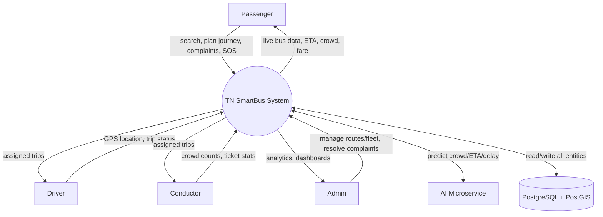
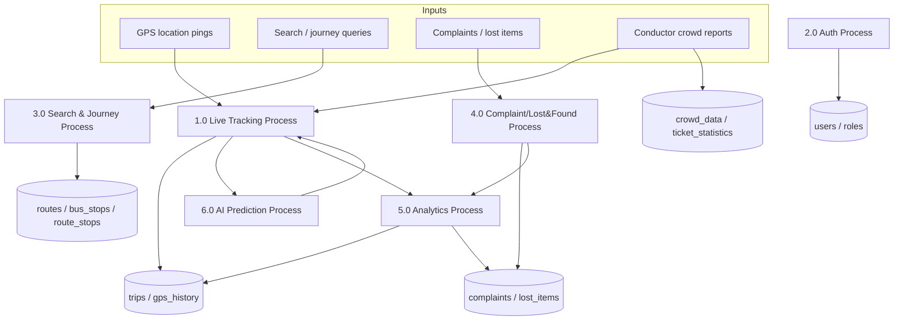

# TN SmartBus — Data Flow Diagram

## Level 0 (Context Diagram)

```mermaid
flowchart TB
    Passenger[Passenger]
    Driver[Driver]
    Conductor[Conductor]
    Admin[Admin]
    System((TN SmartBus System))
    AI[AI Microservice]
    DB[(PostgreSQL + PostGIS)]

    Passenger -->|search, plan journey, complaints, SOS| System
    System -->|live bus data, ETA, crowd, fare| Passenger

    Driver -->|GPS location, trip status| System
    System -->|assigned trips| Driver

    Conductor -->|crowd counts, ticket stats| System
    System -->|assigned trips| Conductor

    Admin -->|manage routes/fleet, resolve complaints| System
    System -->|analytics, dashboards| Admin

    System <-->|predict crowd/ETA/delay| AI
    System <-->|read/write all entities| DB
```

## Level 1 (Backend Decomposition)

```mermaid
flowchart TB
    subgraph Inputs
        GPSIn[GPS location pings]
        SearchIn[Search / journey queries]
        ComplaintIn[Complaints / lost items]
        CrowdIn[Conductor crowd reports]
    end

    P1[1.0 Live Tracking Process]
    P2[2.0 Auth Process]
    P3[3.0 Search & Journey Process]
    P4[4.0 Complaint/Lost&Found Process]
    P5[5.0 Analytics Process]
    P6[6.0 AI Prediction Process]

    DS1[(users / roles)]
    DS2[(trips / gps_history)]
    DS3[(routes / bus_stops / route_stops)]
    DS4[(complaints / lost_items)]
    DS5[(crowd_data / ticket_statistics)]

    GPSIn --> P1
    P1 --> DS2
    P1 --> P6
    P6 --> P1

    SearchIn --> P3
    P3 --> DS3

    ComplaintIn --> P4
    P4 --> DS4

    CrowdIn --> P1
    CrowdIn --> DS5

    P2 --> DS1

    P1 --> P5
    P4 --> P5
    P5 --> DS2
    P5 --> DS4
```
