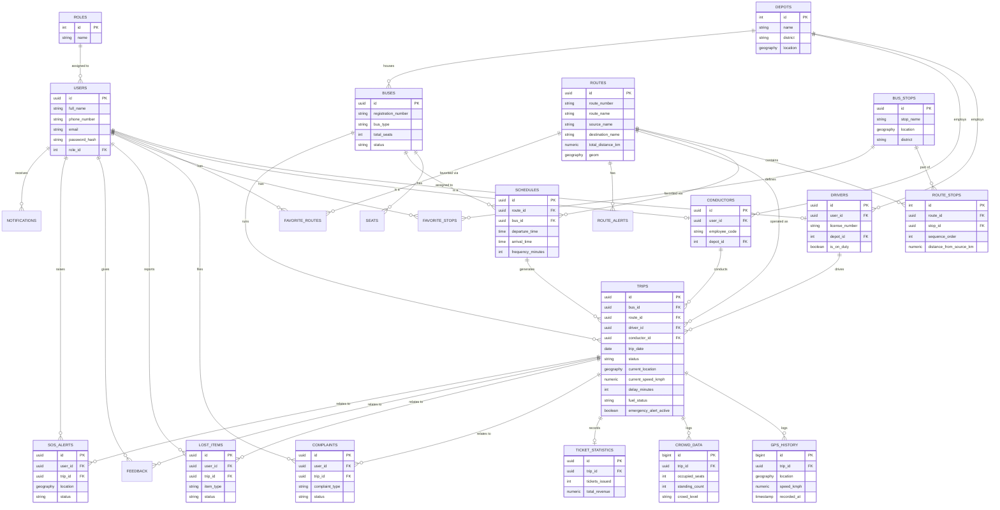

# TN SmartBus — Entity-Relationship Diagram

Reflects `database/schema.sql`. Render with any Mermaid-compatible viewer
(GitHub, VS Code Mermaid extension, mermaid.live).

```mermaid
erDiagram
    ROLES ||--o{ USERS : "assigned to"
    USERS ||--o| DRIVERS : "is a"
    USERS ||--o| CONDUCTORS : "is a"
    USERS ||--o{ FAVORITE_ROUTES : has
    USERS ||--o{ FAVORITE_STOPS : has
    USERS ||--o{ COMPLAINTS : files
    USERS ||--o{ LOST_ITEMS : reports
    USERS ||--o{ FEEDBACK : gives
    USERS ||--o{ SOS_ALERTS : raises
    USERS ||--o{ NOTIFICATIONS : receives

    DEPOTS ||--o{ DRIVERS : employs
    DEPOTS ||--o{ CONDUCTORS : employs
    DEPOTS ||--o{ BUSES : houses

    BUSES ||--o{ SEATS : has
    BUSES ||--o{ SCHEDULES : "assigned to"
    BUSES ||--o{ TRIPS : runs

    ROUTES ||--o{ ROUTE_STOPS : contains
    ROUTES ||--o{ SCHEDULES : defines
    ROUTES ||--o{ TRIPS : "operated as"
    ROUTES ||--o{ ROUTE_ALERTS : has
    ROUTES ||--o{ FAVORITE_ROUTES : "favorited via"

    BUS_STOPS ||--o{ ROUTE_STOPS : "part of"
    BUS_STOPS ||--o{ FAVORITE_STOPS : "favorited via"

    SCHEDULES ||--o{ TRIPS : generates

    DRIVERS ||--o{ TRIPS : drives
    CONDUCTORS ||--o{ TRIPS : conducts

    TRIPS ||--o{ GPS_HISTORY : logs
    TRIPS ||--o{ CROWD_DATA : logs
    TRIPS ||--o| TICKET_STATISTICS : records
    TRIPS ||--o{ COMPLAINTS : "relates to"
    TRIPS ||--o{ LOST_ITEMS : "relates to"
    TRIPS ||--o{ FEEDBACK : "relates to"
    TRIPS ||--o{ SOS_ALERTS : "relates to"

    ROLES {
        int id PK
        string name
    }
    USERS {
        uuid id PK
        string full_name
        string phone_number
        string email
        string password_hash
        int role_id FK
    }
    DEPOTS {
        int id PK
        string name
        string district
        geography location
    }
    DRIVERS {
        uuid id PK
        uuid user_id FK
        string license_number
        int depot_id FK
        boolean is_on_duty
    }
    CONDUCTORS {
        uuid id PK
        uuid user_id FK
        string employee_code
        int depot_id FK
    }
    BUSES {
        uuid id PK
        string registration_number
        string bus_type
        int total_seats
        string status
    }
    ROUTES {
        uuid id PK
        string route_number
        string route_name
        string source_name
        string destination_name
        numeric total_distance_km
        geography geom
    }
    BUS_STOPS {
        uuid id PK
        string stop_name
        geography location
        string district
    }
    ROUTE_STOPS {
        int id PK
        uuid route_id FK
        uuid stop_id FK
        int sequence_order
        numeric distance_from_source_km
    }
    SCHEDULES {
        uuid id PK
        uuid route_id FK
        uuid bus_id FK
        time departure_time
        time arrival_time
        int frequency_minutes
    }
    TRIPS {
        uuid id PK
        uuid bus_id FK
        uuid route_id FK
        uuid driver_id FK
        uuid conductor_id FK
        date trip_date
        string status
        geography current_location
        numeric current_speed_kmph
        int delay_minutes
        string fuel_status
        boolean emergency_alert_active
    }
    GPS_HISTORY {
        bigint id PK
        uuid trip_id FK
        geography location
        numeric speed_kmph
        timestamp recorded_at
    }
    CROWD_DATA {
        bigint id PK
        uuid trip_id FK
        int occupied_seats
        int standing_count
        string crowd_level
    }
    TICKET_STATISTICS {
        uuid id PK
        uuid trip_id FK
        int tickets_issued
        numeric total_revenue
    }
    COMPLAINTS {
        uuid id PK
        uuid user_id FK
        uuid trip_id FK
        string complaint_type
        string status
    }
    LOST_ITEMS {
        uuid id PK
        uuid user_id FK
        uuid trip_id FK
        string item_type
        string status
    }
    SOS_ALERTS {
        uuid id PK
        uuid user_id FK
        uuid trip_id FK
        geography location
        string status
    }
```
