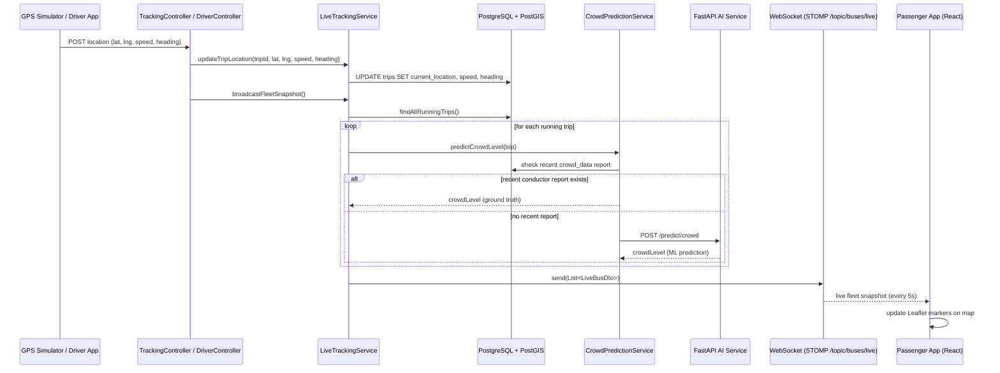
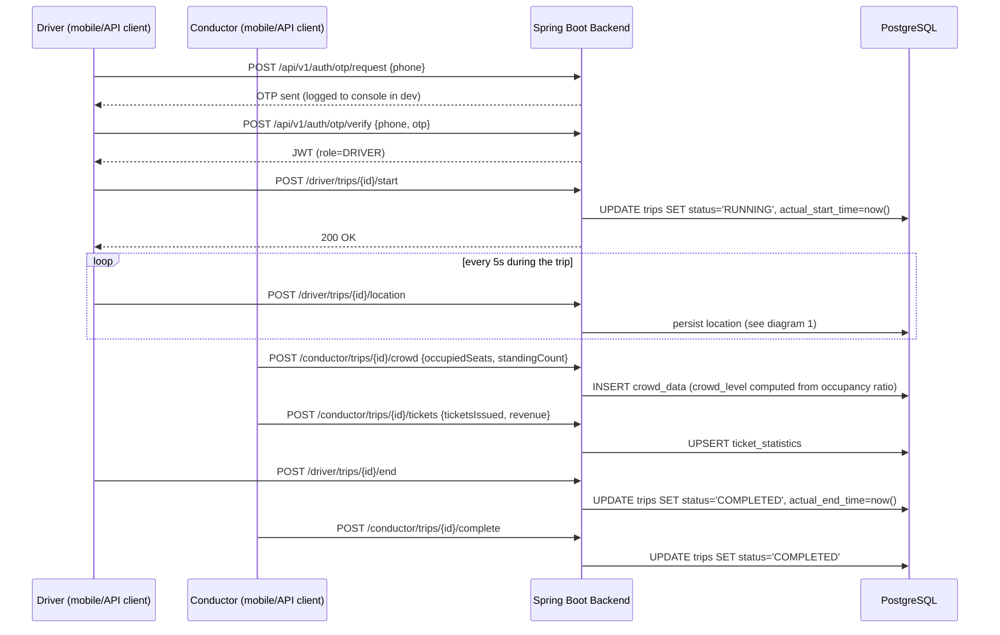
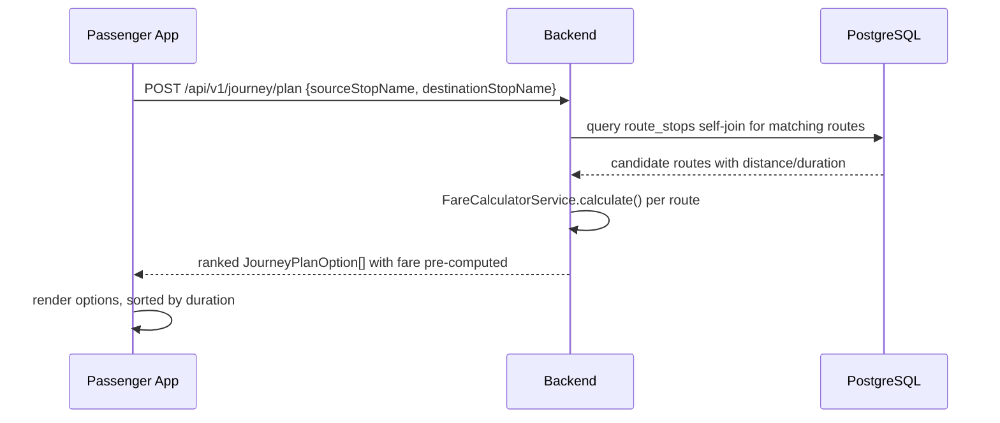

# TN SmartBus — Sequence Diagrams

## 1. GPS ingestion → live tracking broadcast

Covers both sources: the dummy GPS simulator (Phase 1) and a real driver
app / GPS device (Phase 3) — both converge on the same
`LiveTrackingService`, so this diagram applies to either.

## 2. Trip lifecycle (driver + conductor)

## 3. Passenger journey planning

