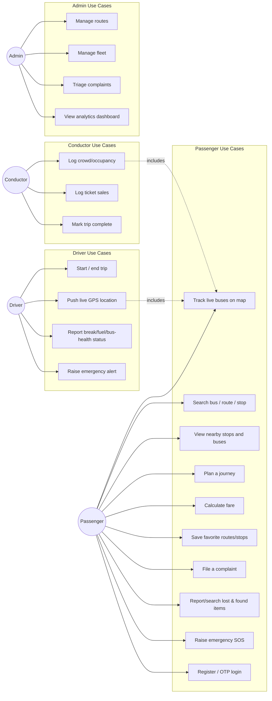

# TN SmartBus — Use Case Diagram

**Notes:**
- `UC12` (driver GPS push) and `UC15` (conductor crowd log) both feed into
  `UC1` (live tracking) — this is the "includes" relationship shown, since
  the passenger-facing live map is only as good as what drivers/conductors
  report.
- All driver/conductor/admin use cases require JWT authentication scoped to
  that role (`SecurityConfig`); passenger use cases 1-3 are public reads,
  4-9 require passenger authentication.
